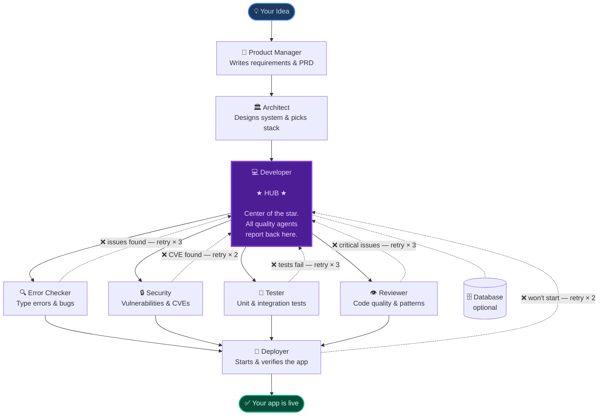

<div align="center">

# 🎵 Orchestra AI

### From idea to running app — fully autonomous.

[](https://www.npmjs.com/package/orchestra-ai-app)
[](https://nodejs.org)
[](LICENSE)
[](https://github.com/miguel2862/orchestra-ai)
[](https://anthropic.com)

<br/>

**You describe a project. Nine specialized AI agents collaborate to build it — writing code, running tests, fixing bugs, and deploying — all without you lifting a finger.**

<br/>

[📦 npm package](https://www.npmjs.com/package/orchestra-ai-app) · [🐛 Issues](https://github.com/miguel2862/orchestra-ai/issues) · [🤖 Powered by Claude Agent SDK](https://github.com/anthropics/claude-code)

<br/>


</div>

---

## ⚡ Three steps. One running app.

```bash
npm install -g orchestra-ai-app   # 1. install once
orchestra-ai                       # 2. run
# 3. describe your project in the browser — agents do the rest
```

A browser window opens automatically. Nine agents start working. You watch the live dashboard.

---

## 🏗️ Architecture — Star Topology, not a pipeline

Most AI coding tools run agents in a straight line: A → B → C → D.
If D fails, the build stops. You start over.

**Orchestra is different.** The **Developer** agent sits at the center of a star. Every quality agent — Error Checker, Security, Tester, Reviewer — branches out from Developer, and can loop *back* to Developer with a detailed report when they find problems. Failures become **automatic retries**, not dead ends.



> **Solid arrows** → forward pass (sequential phases).
> **Dashed arrows** → feedback loops (automatic, only triggered when issues are found).

---

## 🤖 The 9 agents — who does what

Nine specialists. Five phases. One goal: working software you can run immediately.

---

### `Phase 0` · Plan

<table>
<tr>
<td width="60"><h3>🧠</h3></td>
<td>

**Product Manager**

Receives your raw idea and produces a complete **Product Requirements Document** — user stories, acceptance criteria, scope boundaries, edge cases, and a definition of done. Every downstream agent reads this first. Nothing gets built before the spec is tight.

`Produces` → `PRD.md` &nbsp;&nbsp; `Tools` → Web Search · Memory

</td>
</tr>
</table>

---

### `Phase 1` · Design

<table>
<tr>
<td width="60"><h3>🏛️</h3></td>
<td>

**Architect**

Reads the PRD and decides *how* to build it. Picks the tech stack, designs the full folder structure, defines API contracts between services, specifies data models, and writes every architectural decision with its rationale. Developer follows this blueprint exactly.

`Produces` → `ARCHITECTURE.md` &nbsp;&nbsp; `Tools` → Web Search · Memory

</td>
</tr>
</table>

---

### `Phase 2` · Build

<table>
<tr>
<td width="60"><h3>💻</h3></td>
<td>

**Developer** ⭐ *Hub*

The center of the star. Reads PRD + architecture and writes every source file. Also receives structured fix reports from all four quality agents and applies targeted corrections — without rewriting what already works. The only agent that writes production code.

`Produces` → All source files &nbsp;&nbsp; `Tools` → Filesystem · Bash · Web Search · Memory

</td>
</tr>
<tr>
<td width="60"><h3>🗄️</h3></td>
<td>

**Database** *(conditional)*

Activated only when the project needs persistent storage. Designs the full schema, writes migrations, creates seed data, and sets up connection pooling. Runs alongside Developer in Phase 2 so both finish before quality gates begin.

`Produces` → Schema · migrations · seeds &nbsp;&nbsp; `Tools` → Filesystem · Postgres

</td>
</tr>
</table>

---

### `Phase 3` · Quality *(agents run in parallel)*

All four quality agents inspect the same codebase simultaneously. Each one routes its findings directly back to Developer as a structured report — *what broke, where, why, and what to fix.* Developer applies the fix; the agent re-checks. Independent retry budgets mean one gate's retries don't consume another's.

<table>
<tr>
<td width="60"><h3>🔍</h3></td>
<td>

**Error Checker**

Runs the TypeScript compiler, traces imports, checks for missing dependencies, and identifies runtime crashes before they happen. First gate to run — catches the most obvious blockers so the other agents aren't reviewing broken code.

`Triggers feedback when` → type errors · missing imports · runtime exceptions &nbsp;&nbsp; `Max retries` → **3** &nbsp;&nbsp; `Tools` → Filesystem

</td>
</tr>
<tr>
<td width="60"><h3>🔒</h3></td>
<td>

**Security**

Audits for injection vulnerabilities, insecure authentication, exposed credentials, OWASP Top 10 issues, and known CVEs in dependencies. Produces a risk-rated report; only critical and high-severity findings trigger a feedback loop.

`Triggers feedback when` → critical vulnerability detected &nbsp;&nbsp; `Max retries` → **2** &nbsp;&nbsp; `Tools` → Web Search · Filesystem

</td>
</tr>
<tr>
<td width="60"><h3>🧪</h3></td>
<td>

**Tester**

Writes unit and integration tests, then runs them. Reports coverage, identifies untested paths, and sends failing test output back to Developer with exact reproduction steps. Code doesn't pass this gate until the test suite is green.

`Triggers feedback when` → any test is failing &nbsp;&nbsp; `Max retries` → **3** &nbsp;&nbsp; `Tools` → Filesystem · Browser

</td>
</tr>
<tr>
<td width="60"><h3>👁️</h3></td>
<td>

**Reviewer**

Final code review by a senior engineer perspective: correctness, performance, maintainability, dead code, DRY violations, and cross-file reference analysis. Fixes critical issues directly; documents the rest in `CODE_REVIEW.md`.

`Triggers feedback when` → blocker or critical issue found &nbsp;&nbsp; `Max retries` → **3** &nbsp;&nbsp; `Tools` → Filesystem

</td>
</tr>
</table>

---

### `Phase 4` · Ship

<table>
<tr>
<td width="60"><h3>🚀</h3></td>
<td>

**Deployer**

Writes the `Dockerfile`, `docker-compose.yml`, CI/CD workflows, and `.env.example`. Then starts the app and hits real endpoints with HTTP requests to verify it responds correctly. If the app won't start, it sends a structured crash report back to Developer and retries.

`Triggers feedback when` → app fails to start · endpoints don't respond &nbsp;&nbsp; `Max retries` → **2** &nbsp;&nbsp; `Tools` → Browser · Filesystem

`Produces` → `Dockerfile` · `docker-compose.yml` · `.github/workflows/` · `README.md`

</td>
</tr>
</table>

---

## 🔄 Automatic feedback loops

When a quality agent finds a problem, it doesn't just report it — it sends Developer a structured fix brief: *what broke, the exact file and line, why it matters, and what to do.* Developer applies a targeted fix. The quality agent re-checks. This cycle repeats until the gate passes or retries run out.

```
Quality agent finds issue
        │
        ▼
  Structured report ──────────────────────► Developer
  (file · line · why · what to fix)               │
        ▲                                          │ targeted fix
        │                                          ▼
        └──────────────────── re-check ◄─── Quality agent
```

> Retry budgets are **per quality gate** — independent of each other. Error Checker using all 3 of its retries doesn't affect Tester's 3 retries.

**When retries are exhausted:** the pipeline continues rather than stopping. Unresolved issues are recorded in `.orchestra/run_*.json` so you can see exactly what was found, what was attempted, and what remains — usually a small targeted fix away from done.

---

## 🖥️ Live dashboard

Run `orchestra-ai` and your browser opens automatically. You're not watching a spinner — you're watching the orchestra work.

| What you see | Details |
|---|---|
| **Hub-and-spoke visualization** | The star topology rendered live — each agent node lights up as it activates, feedback arrows animate in amber when a loop triggers |
| **Live output stream** | Every action, decision, and file written by each agent — streamed line by line in real time |
| **Per-agent cost tracker** | Token count and USD for each agent, updating as they run — see exactly which agent is expensive |
| **Intervention chat** | Send a message to a running agent mid-execution without stopping the run |
| **Result card** | Clickable `localhost` URL the moment your app is live |
| **Full run history** | Every past project saved — browse event logs, cost breakdowns, and agent stats |

> Defaults to port **3847**, auto-reassigns if busy. Run multiple projects simultaneously — each has its own independent event stream and cost tracker.

---

## 📁 What gets generated

After a full run, your project folder looks like this:

```
my-project/
├── src/                  # all source code written by Developer
├── tests/                # test files written by Tester
├── package.json
├── README.md             # auto-generated project README
├── .env.example          # environment variables template
└── .orchestra/
    ├── run_1712345678.json   # full run memory: cost, agent stats, issues found
    └── profile.json          # aggregated stats across all runs on this project
```

The `.orchestra/` folder is how Orchestra remembers what it built — if you continue or modify the project later, agents can read prior run context.

---

## 🚀 Quick Start

| | |
|---|---|
|  |  |

### macOS / Linux

```bash
npm install -g orchestra-ai-app
orchestra-ai
```

### Windows

Open **PowerShell** or **Command Prompt** as Administrator:

```powershell
npm install -g orchestra-ai-app
orchestra-ai
```

<details>
<summary>Windows execution policy error?</summary>

```powershell
Set-ExecutionPolicy -Scope CurrentUser -ExecutionPolicy RemoteSigned
```

Then re-run `orchestra-ai`.

</details>

On first launch, a **30-second setup wizard** runs automatically — auth method, GitHub token (optional), working directory, and theme.

---

## 📋 Requirements

| | |
|--|--|
| **Node.js** | v18 or higher — [download here](https://nodejs.org) |
| **Claude auth** | Any plan below — Pro, Max, or API key |

### Which Anthropic plan do I need?

| Plan | Price | Works? | Usage |
|---|---|:---:|---|
| **Claude Pro** | $20 / mo | ✅ | Included in plan — lower limits |
| **Claude Max 5×** | $100 / mo | ✅ | 5× more usage than Pro |
| **Claude Max 20×** | $200 / mo | ✅ | 20× more usage than Pro |
| **API key only** | Pay per token | ✅ | No limits — billed directly |

> All plans share the same token pool with claude.ai. Max is recommended for heavy daily use.

**Option A — Claude subscription (Pro or Max)** *(recommended — usage included in plan)*
```bash
npm install -g @anthropic-ai/claude-code
claude login
```

**Option B — Anthropic API key** *(pay per token)*
Get yours at [console.anthropic.com](https://console.anthropic.com) and paste it during the setup wizard.

---

## 💰 Cost

### With a Claude subscription

**No extra token cost.** Orchestra uses your plan's built-in quota — no separate billing. The **Claude Usage** panel in the dashboard shows both limits live so you always know how much headroom you have before starting a project.


Claude subscriptions have two independent rolling windows:

| Limit | Window | How it works |
|-------|--------|------------------|
| **Session** | 5-hour rolling | Resets every 5 hours. The countdown ("Resets in 2h 23m") tells you exactly when you can run again at full speed. |
| **Weekly** | 7-day rolling | Cumulative usage over the last 7 days. Renews the same day and time each week. |

> **Planning a big project?** Glance at the weekly bar first. Above ~80%? Either wait for the session reset (usually a few hours) or switch to API key mode for that run — you won't lose any progress either way.

### With an API key

| Model | Input | Output | Best for |
|-------|------:|------:|---------|
| **Opus 4.6** | $5 / 1M | $25 / 1M | Most complex, long projects |
| **Sonnet 4.6** | $3 / 1M | $15 / 1M | ✅ Recommended balance |
| **Haiku 4.5** | $1 / 1M | $5 / 1M | Fastest, cheapest |

A typical full-stack project (all 9 agents on Sonnet 4.6): **$0.50 – $3.00** depending on complexity.
You can assign a cheaper model to quality-only agents in Settings to cut costs significantly.

> Always verify current prices at [anthropic.com/pricing](https://www.anthropic.com/pricing).

Orchestra always uses the **latest stable model** in each family — no hardcoded version dates that go stale.

---

## ⚙️ Configuration

Everything is configurable from the **Settings** page in the web UI. Config is stored per-user:

| OS | Config location |
|----|-----------------|
| macOS / Linux | `~/.orchestra-ai/config.json` |
| Windows | `C:\Users\YourName\.orchestra-ai\config.json` |

<details>
<summary>All available settings</summary>

| Setting | Description |
|---------|-------------|
| Anthropic API key | For API key auth (Option B) |
| GitHub token | Lets agents create repos and push code |
| Default projects folder | Where new projects are created |
| Main model | Opus 4.6 / Sonnet 4.6 / Haiku 4.5 |
| Subagent model | Use a cheaper model for quality gates to reduce cost |
| Extended thinking | Deeper reasoning for complex projects |
| Budget cap | Maximum USD spend per project |
| Max turns | Hard limit on agent iterations |
| Git auto-commits | Commit after each completed phase |
| UI theme | Dark / Light / System |

</details>

---

## 🧩 MCP Servers

Orchestra uses the [Model Context Protocol](https://modelcontextprotocol.io) to give agents real tools — not just text generation:

| Server | Gives agents the ability to… |
|--------|------------------------------|
| `filesystem` | Read, write, and navigate project files |
| `brave-search` | Search the web for docs, packages, examples |
| `github` | Create repositories and push code |
| `puppeteer` | Control a real browser — screenshots, UI testing |
| `postgres` | Inspect and query databases live |
| `memory` | Share persistent context across all agents |

Enable or disable each server from **Settings → MCP Servers**.

---

## 📂 Project templates

| Template | What it builds |
|----------|----------------|
| **Full-stack web app** | React frontend + Node/Express API |
| **API backend** | REST or GraphQL API with auth |
| **Landing page** | Static site with modern design |
| **CLI tool** | Node.js command-line utility |
| **Custom** | Describe anything in plain English |

---

## ❓ Frequently asked

<details>
<summary>Does it work on existing projects or only new ones?</summary>

Currently Orchestra is optimized for **building new projects from scratch**. Running it on an existing codebase is possible but the agents will treat the existing files as their starting context — results may vary. A "continue existing project" mode is on the roadmap.

</details>

<details>
<summary>Can I stop a run midway and resume it?</summary>

Yes — and it picks up exactly where it left off. When you click **Stop**, Orchestra saves the Claude session ID. When you click **Continue**, it uses the Claude Agent SDK's built-in session resume to restore the full conversation context: which agents ran, what code was written, where the pipeline was. Claude doesn't start over — it continues from that exact point.

Note: the **Continue** button appears after the run ends (completed, failed, or stopped). There is no mid-run pause — Stop is immediate.

</details>

<details>
<summary>What happens if Claude hits a rate limit mid-run?</summary>

The Claude Agent SDK handles rate limit retries automatically with exponential backoff. If the limit is sustained (e.g., a weekly cap is reached), the active agent will fail and the run will report an error. Your generated files up to that point are preserved.

</details>

<details>
<summary>Can I run multiple projects at the same time?</summary>

Yes. The server tracks each run independently in memory and on disk. Start a second project from "New Project" while the first is running — both appear in the sidebar with their own live output streams. Keep in mind that parallel runs consume tokens in parallel, which hits subscription limits faster.

</details>

<details>
<summary>Where are my projects and run history saved?</summary>

- **Project files** → the working directory you chose during setup (default: `~/orchestra-projects/`)
- **Run logs** → `~/.claude/projects/` — one JSON file and one JSONL event log per project
- **Run memory** → inside each project at `.orchestra/run_*.json`

</details>

<details>
<summary>Is my API key or GitHub token stored securely?</summary>

Both are stored in `~/.orchestra-ai/config.json` on your local machine — they never leave your device except when making API calls directly to Anthropic or GitHub. Orchestra does not have a backend server; everything runs locally.

</details>

---

## 🔧 Troubleshooting

<details>
<summary>Updating to a new version — "file already exists" error</summary>

If you already have Orchestra installed and `npm install -g orchestra-ai-app` throws an `EEXIST` error, uninstall first:

```bash
npm uninstall -g orchestra-ai-app && npm install -g orchestra-ai-app
```

</details>

<details>
<summary>Command not found after install</summary>

Make sure npm's global bin directory is in your `PATH`. Run `npm bin -g` to find it, then add it to your shell profile (`.zshrc`, `.bashrc`, etc.).

On macOS with Homebrew-managed Node, the global bin is usually `/opt/homebrew/bin` — which is already in PATH by default.

</details>

<details>
<summary>Browser doesn't open automatically</summary>

Navigate manually to `http://localhost:3847` (or whatever port is shown in the terminal output). On Windows, `start` and `open` commands can sometimes be blocked by security policies.

</details>

<details>
<summary>orchestra-ai hangs on startup</summary>

Check that port 3847 (or whichever port it picked) isn't blocked by a firewall. Try stopping any other local servers and rerunning. You can also check the terminal for the exact port being used.

</details>

---

## 🪟 Windows notes

- Paths use platform-native separators — handled automatically
- `orchestra-ai` works in PowerShell, CMD, and Windows Terminal
- Orchestra auto-detects `claude.cmd` when using Option A
- Projects default to `C:\Users\YourName\orchestra-projects\`

---

## 🛠️ Development

<details>
<summary>Run locally from source</summary>

```bash
git clone https://github.com/miguel2862/orchestra-ai.git
cd orchestra-ai
npm install
npm run dev        # starts server + UI in watch mode
```

```bash
npm run build      # production build
npm run typecheck  # TypeScript check with no emit
```

</details>

---

## 📄 License

MIT — free to use, modify, and distribute.

---

<div align="center">

Built with the [Claude Agent SDK](https://github.com/anthropics/claude-code) by Anthropic

</div>
