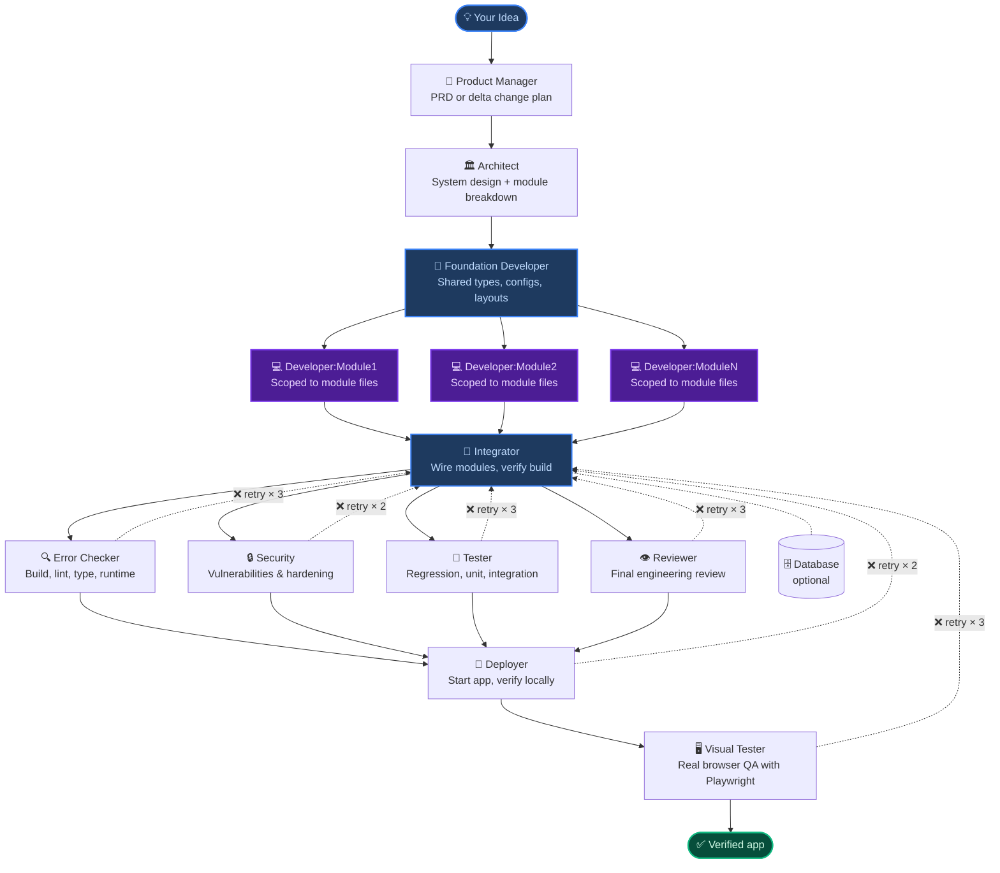

<div align="center">



<br/>

[](https://www.npmjs.com/package/orchestra-ai-app)
[](https://nodejs.org)
[](LICENSE)
[](https://anthropic.com)

<br/>

**Describe a new product or point Orchestra at an existing repo.**<br/>
**Up to 13 specialized agents plan, build in parallel, review, deploy, and QA in a real browser.**

<br/>

[📦 Install](https://www.npmjs.com/package/orchestra-ai-app) · [🐛 Issues](https://github.com/miguel2862/orchestra-ai/issues) · [🤖 Claude Agent SDK](https://github.com/anthropics/claude-code)

</div>


<table>
<tr>
<td width="50%">

### New project or existing repo

Start from a blank idea or point Orchestra at a real repository. `Existing Project` mode audits first, then applies surgical changes instead of rewriting.

</td>
<td width="50%">

### Parallel developers for big projects

When the Architect defines multiple modules, Orchestra launches **N developer agents in parallel** — each scoped to its own files — then an Integrator wires everything together. Small projects still use a single developer.

</td>
</tr>
<tr>
<td width="50%">

### Feedback loops instead of dead ends

Quality gates route structured fix briefs back to the right developer (by module), retry with independent budgets, and keep the project moving instead of forcing a full restart.

</td>
<td width="50%">

### Real browser QA, not fake confidence

The `visual_tester` agent opens the live app with Playwright, clicks controls, types into forms, checks console errors, captures screenshots, and blocks the run when something looks interactive but does nothing.

</td>
</tr>
</table>


## What it looks like

<div align="center">

| | |
|---|---|
|  |  |
| **Brief the run** — start from a raw idea or give Orchestra an existing repo | **Tune models** — pick main vs subagent, budget, git, and project mode |

</div>

The dashboard is the product, not a loading screen:

- Hub-and-spoke pipeline with live agent activation and animated feedback loops
- **Dynamic pipeline visualization** — shows N parallel developer nodes when modules are detected
- Streamed output and structured events in real time
- Per-agent cost and token tracking with AnimeJS animations
- Claude usage panel with live subscription limits (session + weekly windows)
- History, recovery, and continue-from-session support
- Light and dark themes with premium glass-morphism design


## Architecture — parallel developers, not a single bottleneck

Most AI coding tools run one agent that writes everything sequentially. If the project is large, the context window fills up and quality drops.

**Orchestra v0.4.0 introduces parallel module development:**

```
          Architect defines N modules
                    ↓
        Developer:Foundation
        (creates shared types, configs, layouts)
                    ↓
    ┌──── Developer:Module1 ────┐
    ├──── Developer:Module2 ────┤  ← run in parallel
    ├──── Developer:Module3 ────┤
    └──── Developer:ModuleN ────┘
                    ↓
              Integrator
        (wires modules, fixes cross-module issues,
         verifies build passes as a unit)
                    ↓
          Quality gates → Deploy → Visual QA
```

**Three layers prevent file conflicts:**

1. **Foundation Developer** runs first — creates all shared files (types, configs, layouts, utils). Module developers only import from these, never modify them.
2. **Strict scope** — each module developer receives an exact file list from the Architect. The prompt says "do NOT modify files outside your scope."
3. **Integrator** runs after all parallels — reads everything, fixes incompatibilities, wires routes/navigation, and verifies `tsc --noEmit` + `npm run build` pass.

> **Fallback:** if the Architect doesn't define modules (small project), Orchestra uses a single Developer — exactly like before.


## Full pipeline



> **Solid arrows** → forward pass. **Dashed arrows** → feedback loops (automatic retries).
> For small projects without modules, the Foundation/Module/Integrator layer collapses into a single Developer.


## The agents — up to 13 depending on project complexity

Nine core agents run on every project. Up to four more join dynamically: Database (when persistence is needed), Foundation Developer, N Module Developers, and Integrator (when the Architect defines modules).

### Phase 0 · Plan

| | |
|:---:|---|
| 🧠 | **Product Manager** — receives your raw idea and produces a complete PRD. In `Existing Project` mode it starts with a repo audit and writes the PRD as a delta change plan. `Tools:` Web Search · Web Fetch |

### Phase 1 · Design

| | |
|:---:|---|
| 🏛️ | **Architect** — reads the PRD and designs the system. For large projects, it also produces a `<!-- MODULES -->` block in ARCHITECTURE.md that defines independent modules with scoped file lists. This triggers parallel development. `Tools:` Filesystem · Web Search |

### Phase 2 · Build

This phase adapts to project size:

**Small projects (no modules defined):**

| | |
|:---:|---|
| 💻 | **Developer** — single agent that reads PRD + architecture and writes all production code. Also receives fix reports from quality gates. `Tools:` Filesystem · Bash |

**Large projects (modules defined by Architect):**

| | |
|:---:|---|
| 🔧 | **Foundation Developer** — runs FIRST, before any module developer. Creates all shared files: types, configs, layouts, navigation, utilities, and installs dependencies. `Tools:` Filesystem · Bash |
| 💻 | **Developer:Module1…N** — N agents launched IN PARALLEL, each scoped to a specific module's files. They import from Foundation's shared files but never modify them. `Tools:` Filesystem · Bash |
| 🔗 | **Integrator** — runs AFTER all module developers complete. Reads all code, fixes cross-module incompatibilities, wires routing/navigation, and verifies `tsc --noEmit` + `npm run build` pass. `Tools:` Filesystem · Bash |

**Conditional:**

| | |
|:---:|---|
| 🗄️ | **Database** — activated only when the project needs persistent storage. Designs schema, migrations, indexes, and seeds. `Tools:` Filesystem · Bash |

### Phase 3 · Quality Gates

Quality agents inspect the codebase with independent retry budgets. Each routes findings back as a structured fix brief. In parallel-dev mode, fixes are routed to the specific module's developer or to the Integrator for cross-module issues.

| | | Retries |
|:---:|---|:---:|
| 🔍 | **Error Checker** — build, lint, typecheck, runtime validation. Error Checker and Security run **in parallel**. | ×3 |
| 🔒 | **Security** — injection, auth, credentials, OWASP-style issues. Runs **in parallel** with Error Checker. | ×2 |
| 🧪 | **Tester** — regression, unit, and integration tests. Uses the repo's test framework for existing projects. | ×3 |
| 👁️ | **Reviewer** — final code review: correctness, performance, maintainability, risky patterns. | ×3 |

### Phase 4 · Ship + Browser QA

| | | Retries |
|:---:|---|:---:|
| 🚀 | **Deployer** — writes Dockerfile, CI/CD, `.env.example`, starts app locally, verifies URL, writes `ORCHESTRA_REPORT.md`. Temporary listeners are cleaned up after the run finishes. | ×2 |
| 🖥️ | **Visual Tester** — opens the running app in a real browser via Playwright MCP. Navigates routes, clicks controls, types into forms, inspects console, captures screenshots. Fails the run if interactive controls do nothing. | ×3 |


## Automatic feedback loops

When a quality gate finds a problem:

```
Quality gate finds issue
        │
        ▼
  Structured report ──────────────────────► Developer (or Integrator)
  (file · line · why · what to fix)               │
        ▲                                          │ targeted fix
        │                                          ▼
        └──────────────────── re-check ◄──── Quality gate
```

- Retry budgets are **per gate** — Error Checker using all 3 retries doesn't consume Tester's
- In parallel-dev mode, fixes are routed by file path to the **correct module's developer**, or to the **Integrator** if the issue is cross-module
- When retries are exhausted, the pipeline continues — unresolved issues are recorded in `.orchestra/run_*.json`
- **Hard artifact gates:** the run requires `PRD.md`, `ARCHITECTURE.md`, `VISUAL_TEST_REPORT.md`, and `ORCHESTRA_REPORT.md`


## Live dashboard

Run `orchestra-ai` and your browser opens automatically:

| What you see | Details |
|---|---|
| **Dynamic pipeline visualization** | Shows the actual agents running — including N parallel developer nodes when modules are detected. Each node lights up as it activates and feedback arrows animate on loops. |
| **Live output stream** | Actions, decisions, file writes, and verification steps streamed in real time |
| **Per-agent cost tracker** | Token count and USD for each agent (including per-module developers), updating live |
| **AnimeJS animations** | Staggered reveals, count-up numbers, fade-ins, and the animated logo with floating music notes |
| **Claude usage panel** | Live session (5h) and weekly (7d) limits from Anthropic API + CodexBar fallback |
| **Intervention chat** | Send a message to a running project without discarding context |
| **History + recovery** | Past projects with stored events, cost breakdowns, and agent stats |
| **Light + dark themes** | Premium glass-morphism design that adapts to system preference |

> Defaults to port **3847**, auto-reassigns if busy. Multiple projects can run simultaneously.


## Quick Start

### macOS / Linux

```bash
npm install -g orchestra-ai-app
orchestra-ai
```

### Windows

```powershell
npm install -g orchestra-ai-app
orchestra-ai
```

<details>
<summary>Windows execution policy error?</summary>

```powershell
Set-ExecutionPolicy -Scope CurrentUser -ExecutionPolicy RemoteSigned
```

</details>

On first launch, a setup wizard runs — auth method, API keys, working directory, model defaults, MCP servers, and theme.


## Two modes

| Mode | What Orchestra does |
|------|----------------------|
| **New Project** | Creates a fresh working directory, writes PRD and architecture from scratch, builds the app (single or parallel developers), deploys, and visually verifies |
| **Existing Project** | Works in-place on a repo you provide, starts with a repo audit, writes a delta change plan, preserves repo conventions, uses your `start` / `test` / `lint` commands, focuses on surgical changes |

For existing repos you can add a `.orchestrarc` file with stack guardrails, conventions, and timeout overrides.


## Cost

### With a Claude subscription

**No extra token cost.** Orchestra uses your plan's built-in quota.

| Plan | Price | Works? |
|---|---|:---:|
| **Claude Pro** | $20 / mo | ✅ |
| **Claude Max 5×** | $100 / mo | ✅ |
| **Claude Max 20×** | $200 / mo | ✅ |
| **API key only** | Pay per token | ✅ |

### With an API key

| Model | Input | Output |
|-------|------:|------:|
| **Opus 4.6** | $5 / 1M | $25 / 1M |
| **Sonnet 4.6** | $3 / 1M | $15 / 1M |
| **Haiku 4.5** | $1 / 1M | $5 / 1M |

A typical full-stack project on Sonnet 4.6: **$0.50 – $3.00**. Parallel developers may increase cost slightly but reduce total time significantly.

> Always verify at [anthropic.com/pricing](https://www.anthropic.com/pricing).


## Port cleanup and process management

Orchestra aggressively cleans up child processes and ports:

- **On project stop** — kills all known port listeners + scans for any node/vite/npm/webpack process whose working directory matches the project
- **On project delete** — automatically stops the project first (killing agents + cleaning ports) before removing metadata
- **On server shutdown** (SIGTERM/SIGINT) — gracefully stops all active projects
- **Second sweep** — 3 seconds after stop, a second cleanup pass catches late-binding processes
- **Orphan detection** — finds processes by CWD match, not just tracked ports, catching grandchild processes that survive `q.close()`


## Configuration

Everything is configurable from **Settings** in the web UI. Config lives at `~/.orchestra-ai/config.json`.

<details>
<summary>All settings</summary>

| Setting | Description |
|---------|-------------|
| Anthropic API key | For API key auth |
| GitHub token | Lets deploy flows create repos and push code |
| Gemini API key | Optional AI asset generation |
| Default projects folder | Where new projects are created |
| Main model | Latest aliases or pinned snapshots |
| Subagent model | Use a cheaper model for specialized gates |
| Extended thinking | Deeper reasoning for harder projects |
| Budget cap | Maximum USD per project |
| Max turns | Hard limit on agent iterations |
| Git auto-commits | Commit after completed phases |
| UI theme | Light / Dark / System |
| MCP servers | Per-server enable/disable |

</details>

Repo-level overrides in `.orchestrarc`:

```json
{
  "pipeline": { "subagentStallTimeoutMs": 900000 },
  "stack": {
    "enabledGuards": ["react_rendering", "motion_accessibility"],
    "guardrails": ["Do not edit files under legacy/"]
  },
  "agents": {
    "architect": { "stallTimeoutMs": 1200000 },
    "developer": { "stallTimeoutMs": 1200000 }
  }
}
```


## MCP Servers

| Server | Capability |
|--------|-----------|
| `filesystem` | Read, write, edit, and navigate project files |
| `duckduckgo` | Search the web for docs, packages, and examples |
| `playwright` | Control a real browser — navigate, click, type, inspect |
| `context7` | Current package and framework documentation |
| `memory` | Persistent context across runs |
| `sequential-thinking` | Structured reasoning for complex tasks |


## Learning and guardrails

Orchestra keeps a self-learning store in `~/.orchestra-ai/lessons.json`:

- Lessons are extracted from agent outputs, feedback loops, user feedback, and runtime-gate failures
- Relevant lessons are injected into later prompts so repeated mistakes become less likely
- Repo-level guardrails from `.orchestrarc` are merged for project-specific enforcement
- Runtime gates remain the source of truth — learned behavior helps, but artifacts and browser evidence are required


## What gets generated

```
my-project/
├── src/                       # production code (may span multiple modules)
├── tests/                     # tests by Tester agent
├── package.json
├── PRD.md                     # requirements / delta plan
├── ARCHITECTURE.md            # system design + module breakdown
├── README.md                  # generated project README
├── ORCHESTRA_REPORT.md        # consolidated report
├── .env.example
└── .orchestra/
    ├── run_1712345678.json    # full run memory with per-module stats
    └── profile.json           # aggregated stats across all runs
```


## FAQ

<details>
<summary>When do parallel developers activate?</summary>

When the Architect's ARCHITECTURE.md contains a `<!-- MODULES -->` block with 2+ modules. Each module has an id, name, scoped file list, and dependencies. If the Architect doesn't produce this block (small projects), Orchestra falls back to a single Developer — exactly like previous versions.

</details>

<details>
<summary>Does it work on existing projects?</summary>

Yes. `Existing Project` mode works in-place, starts with a repo audit, writes a delta plan, and applies surgical changes with regression coverage.

</details>

<details>
<summary>Does the visual tester open a real browser?</summary>

Yes — via Playwright MCP. It navigates routes, clicks controls, types into forms, captures snapshots, and fails the run if interactive controls do nothing.

</details>

<details>
<summary>Can I stop a run and resume?</summary>

Yes — Orchestra stores the session ID. Click **Continue** to resume the saved conversation context.

</details>

<details>
<summary>Do temporary dev servers stay open after the run?</summary>

No. Orchestra aggressively cleans up: tracked ports, CWD-matched processes, second-sweep after 3s, and graceful shutdown on SIGTERM/SIGINT. Even orphaned grandchild processes (Vite, webpack) are caught.

</details>

<details>
<summary>Can Orchestra use Gemini to create images?</summary>

Yes, on-demand. When a Gemini API key is configured, the Developer can generate project-specific assets (hero illustrations, before/after scenes, custom icons). If Gemini is unavailable, the run continues without blocking.

</details>

<details>
<summary>Can I run multiple projects simultaneously?</summary>

Yes. Each run has its own event stream and cost tracker.

</details>

<details>
<summary>Where is data stored?</summary>

- **Project files** → your working directory (default: `~/orchestra-projects/`)
- **Metadata + events** → `~/.orchestra-ai/projects/`
- **Config** → `~/.orchestra-ai/config.json`
- **Lessons** → `~/.orchestra-ai/lessons.json`
- **Run memory** → `.orchestra/run_*.json` inside each project

</details>


## Troubleshooting

<details>
<summary>"File already exists" error when updating</summary>

```bash
npm uninstall -g orchestra-ai-app && npm install -g orchestra-ai-app
```

</details>

<details>
<summary>Command not found after install</summary>

Make sure npm's global bin directory is in your `PATH`. Run `npm bin -g` to find it.

</details>

<details>
<summary>Browser doesn't open automatically</summary>

Navigate to `http://localhost:3847` or the port shown in the terminal.

</details>


## Development

```bash
git clone https://github.com/miguel2862/orchestra-ai.git
cd orchestra-ai
npm install
npm run dev        # server + UI in watch mode
npm run build      # production build
npm run typecheck  # TypeScript check
```


<div align="center">

**MIT License** — free to use, modify, and distribute.

<br/>

Built with [AnimeJS](https://animejs.com) animations · Powered by the [Claude Agent SDK](https://github.com/anthropics/claude-code) by Anthropic

<br/>

<sub>Orchestra AI v0.4.0</sub>

</div>
