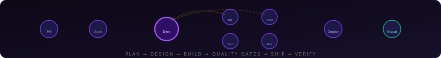

<div align="center">


<br/>

**One command. Ten AI agents. From raw idea to browser-verified app.**<br/>
**New projects or existing repos — Orchestra handles both.**

<br/>

[](https://www.npmjs.com/package/orchestra-ai-app)
[](https://nodejs.org)
[](LICENSE)
[](https://anthropic.com)

<br/>

```bash
npm install -g orchestra-ai-app@latest && orchestra-ai
```

<br/>

[📦 Install](https://www.npmjs.com/package/orchestra-ai-app) · [🐛 Issues](https://github.com/miguel2862/orchestra-ai/issues) · [🤖 Claude Agent SDK](https://github.com/anthropics/claude-code)

</div>


## The Pipeline

<div align="center">

</div>

<br/>

<table>
<tr>
<td width="50%">

### New project or existing repo

Start from a blank idea or point Orchestra at a real repository. `Existing Project` mode audits first, then applies surgical changes instead of rewriting.

</td>
<td width="50%">

### Real browser QA, not fake confidence

The `visual_tester` agent opens the live app with Playwright, clicks controls, types into forms, checks console errors, captures screenshots, and blocks the run when something looks interactive but does nothing.

</td>
</tr>
<tr>
<td width="50%">

### Feedback loops instead of dead ends

Quality gates route structured fix briefs back to `developer`, retry with their own budgets, and keep the project moving instead of forcing a full restart.

</td>
<td width="50%">

### Built for real local workflows

Works on macOS, Windows, and Linux. Runs from a global npm install, opens a local dashboard, tracks cost, stores run memory, and cleans up temporary listeners after verification.

</td>
</tr>
</table>


## What it looks like

<div align="center">

| | |
|---|---|
|  |  |
| **Brief the run** — start from a raw idea or give Orchestra an existing repo | **Tune models** — pick main vs subagent, budget, git, and project mode |

</div>

The dashboard is the product, not a loading screen:

- Hub-and-spoke pipeline with live agent activation and animated feedback loops
- Streamed output and structured events while work is happening
- Per-agent cost and token tracking with AnimeJS animations
- History, recovery, and continue-from-session support
- Claude usage panel with live subscription limits (session + weekly windows)
- Light and dark themes


## Architecture — controlled graph, not a blind pipeline

Most AI coding tools run agents in a straight line: A → B → C → D. If D fails, the build stops.

**Orchestra is different.** The **Developer** sits at the center of a star. Quality gates branch out, loop back with structured fix briefs when they fail, and only continue to deploy and browser QA when everything passes.


> **Solid arrows** → forward pass (planned phases).
> **Dashed arrows** → feedback loops (automatic, only triggered when issues are found).


## The 10 agents — 9 core + 1 conditional

Nine required agents run on every project. The tenth, `database`, joins when the project needs persistence.

### Phase 0 · Plan

| | |
|:---:|---|
| 🧠 | **Product Manager** — receives your raw idea and produces a complete PRD. In `Existing Project` mode it starts with a repo audit and writes the PRD as a delta change plan. |

### Phase 1 · Design

| | |
|:---:|---|
| 🏛️ | **Architect** — reads the PRD and decides *how* to build it. For greenfield work it designs the full system. For existing repos it writes the minimal architecture delta. |

### Phase 2 · Build

| | |
|:---:|---|
| 💻 | **Developer** ⭐ *Hub* — the center of the star. Writes production code and receives structured fix reports from quality agents. If Gemini is configured, can generate project-specific assets on demand. |
| 🗄️ | **Database** *(conditional)* — activated only when the project needs persistent storage. Designs schema, migrations, indexes, and seeds. |

### Phase 3 · Quality Gates

Quality agents inspect the codebase with independent retry budgets. Each routes findings back to Developer as a structured fix brief.

| | | Retries |
|:---:|---|:---:|
| 🔍 | **Error Checker** — build, lint, typecheck, and runtime validation | ×3 |
| 🔒 | **Security** — injection, auth, credentials, OWASP-style issues | ×2 |
| 🧪 | **Tester** — regression, unit, and integration tests | ×3 |
| 👁️ | **Reviewer** — final code review from a principal engineer perspective | ×3 |

### Phase 4 · Ship + Browser QA

| | | Retries |
|:---:|---|:---:|
| 🚀 | **Deployer** — Dockerfile, CI/CD, starts app locally, verifies URL, writes `ORCHESTRA_REPORT.md` | ×2 |
| 🖥️ | **Visual Tester** — real browser QA with Playwright: navigate, click, type, inspect console, capture screenshots | ×3 |


## Quick Start

### macOS / Linux

```bash
npm install -g orchestra-ai-app
orchestra-ai
```

### Windows

```powershell
npm install -g orchestra-ai-app
orchestra-ai
```

<details>
<summary>Windows execution policy error?</summary>

```powershell
Set-ExecutionPolicy -Scope CurrentUser -ExecutionPolicy RemoteSigned
```

Then re-run `orchestra-ai`.

</details>

On first launch, a setup wizard runs automatically — auth method, API keys or Claude login, working directory, model defaults, MCP servers, and theme.


## Cost

### With a Claude subscription

**No extra token cost.** Orchestra uses your plan's built-in quota. The dashboard shows both limits live.

| Plan | Price | Works? | Usage |
|---|---|:---:|---|
| **Claude Pro** | $20 / mo | ✅ | Included — lower limits |
| **Claude Max 5×** | $100 / mo | ✅ | 5× more usage |
| **Claude Max 20×** | $200 / mo | ✅ | 20× more usage |
| **API key only** | Pay per token | ✅ | No limits |

### With an API key

| Model | Input | Output | Best for |
|-------|------:|------:|---------|
| **Opus 4.6** | $5 / 1M | $25 / 1M | Complex, long projects |
| **Sonnet 4.6** | $3 / 1M | $15 / 1M | Recommended balance |
| **Haiku 4.5** | $1 / 1M | $5 / 1M | Fastest, cheapest |

A typical full-stack project on Sonnet 4.6: **$0.50 – $3.00**

> Always verify current prices at [anthropic.com/pricing](https://www.anthropic.com/pricing).


## Configuration

Everything is configurable from **Settings** in the web UI.

<details>
<summary>Global settings</summary>

| Setting | Description |
|---------|-------------|
| Anthropic API key | For API key auth |
| GitHub token | Lets deploy flows create repos and push code |
| Gemini API key | Optional AI asset generation |
| Default projects folder | Where new projects are created |
| Main model | Latest aliases or pinned snapshots |
| Subagent model | Use a cheaper model for specialized gates |
| Extended thinking | Deeper reasoning for harder projects |
| Budget cap | Maximum USD spend per project |
| Max turns | Hard limit on agent iterations |
| Git auto-commits | Commit after completed phases |
| UI theme | Light / Dark / System |
| MCP servers | Per-server enable/disable in the UI |

</details>

Repo-level overrides live in `.orchestrarc` inside the target repository:

```json
{
  "pipeline": { "subagentStallTimeoutMs": 900000 },
  "stack": {
    "enabledGuards": ["react_rendering", "motion_accessibility"],
    "guardrails": ["Do not edit files under legacy/"]
  },
  "agents": {
    "architect": { "stallTimeoutMs": 1200000 },
    "developer": { "stallTimeoutMs": 1200000 }
  }
}
```


## MCP Servers

Orchestra uses the [Model Context Protocol](https://modelcontextprotocol.io) to give agents real tools:

| Server | Capability |
|--------|-----------|
| `filesystem` | Read, write, edit, and navigate project files |
| `duckduckgo` | Search the web for docs, packages, and examples |
| `playwright` | Control a real browser — navigate, click, type, inspect |
| `context7` | Current package and framework documentation |
| `memory` | Persistent context across runs |
| `sequential-thinking` | Structured reasoning for complex tasks |


## Project templates

| Template | What it builds |
|----------|----------------|
| **Full-stack web app** | Frontend + backend with production setup |
| **API backend** | REST or GraphQL API with auth and docs |
| **Landing page** | Static marketing site |
| **CLI tool** | Node.js command-line utility |
| **Custom** | Describe anything in plain English |


## What gets generated

```
my-project/
├── src/                       # production code
├── tests/                     # tests by Tester agent
├── package.json
├── PRD.md                     # requirements / delta plan
├── ARCHITECTURE.md            # system design
├── README.md                  # generated project README
├── ORCHESTRA_REPORT.md        # consolidated report
├── .env.example
└── .orchestra/
    ├── run_1712345678.json    # full run memory
    └── profile.json           # aggregated stats
```


## FAQ

<details>
<summary>Does it work on existing projects?</summary>

Yes. `Existing Project` mode works in-place on a repo path, starts with a repo audit, writes a delta plan, and applies surgical changes with regression coverage.

</details>

<details>
<summary>Does the visual tester open a real browser?</summary>

Yes — via Playwright MCP. It navigates routes, clicks controls, types into forms, captures snapshots, and fails the run if interactive controls do nothing.

</details>

<details>
<summary>Can I stop a run and resume?</summary>

Yes — Orchestra stores the session ID. Click **Continue** to resume the saved conversation context.

</details>

<details>
<summary>Do temporary dev servers stay open after the run?</summary>

No. Orchestra cleans up all listeners started from the project's working directory — including orphaned child processes (Vite, webpack, etc.) that survive agent termination.

</details>

<details>
<summary>Can I run multiple projects simultaneously?</summary>

Yes. Each run has its own event stream and cost tracker.

</details>

<details>
<summary>Where is data stored?</summary>

- **Project files** → your working directory (default: `~/orchestra-projects/`)
- **Metadata + events** → `~/.orchestra-ai/projects/`
- **Config** → `~/.orchestra-ai/config.json`
- **Lessons** → `~/.orchestra-ai/lessons.json`
- **Run memory** → `.orchestra/run_*.json` inside each project

</details>


## Troubleshooting

<details>
<summary>"File already exists" error when updating</summary>

```bash
npm uninstall -g orchestra-ai-app && npm install -g orchestra-ai-app
```

</details>

<details>
<summary>Command not found after install</summary>

Make sure npm's global bin directory is in your `PATH`. Run `npm bin -g` to find it.

</details>

<details>
<summary>Browser doesn't open automatically</summary>

Navigate to `http://localhost:3847` or the port shown in the terminal.

</details>


## Development

```bash
git clone https://github.com/miguel2862/orchestra-ai.git
cd orchestra-ai
npm install
npm run dev        # server + UI in watch mode
npm run build      # production build
npm run typecheck  # TypeScript check
```


<div align="center">

**MIT License** — free to use, modify, and distribute.

<br/>

Built with [AnimeJS](https://animejs.com) animations · Powered by the [Claude Agent SDK](https://github.com/anthropics/claude-code) by Anthropic

<br/>

<sub>Orchestra AI v0.4.0</sub>

</div>
