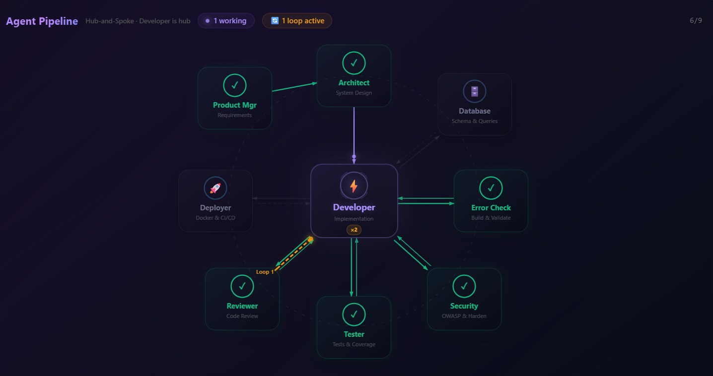
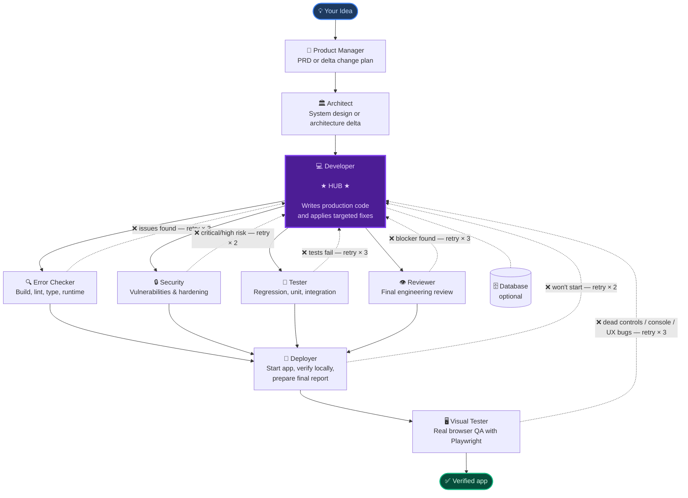
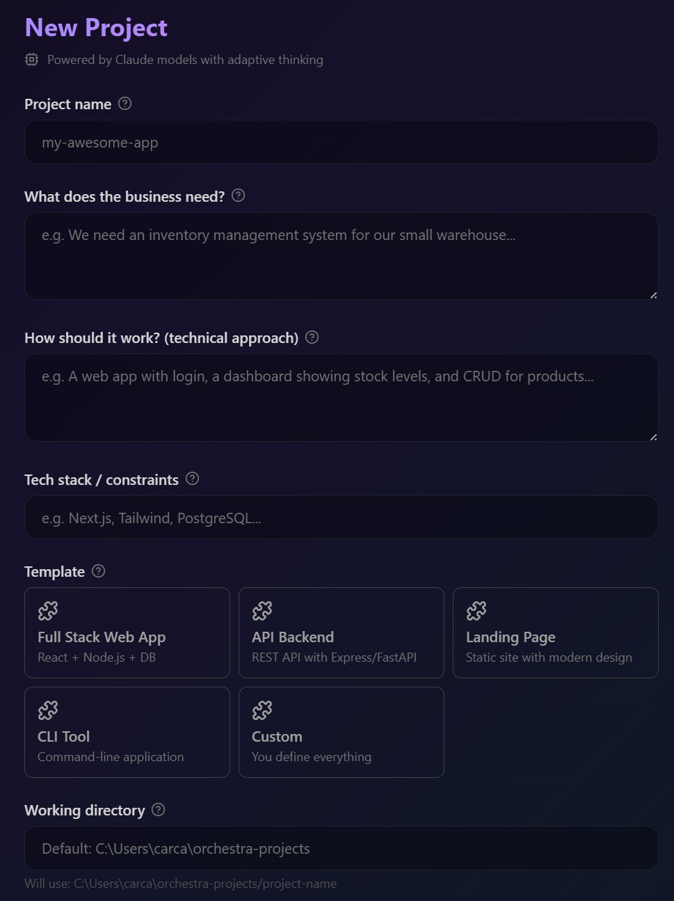
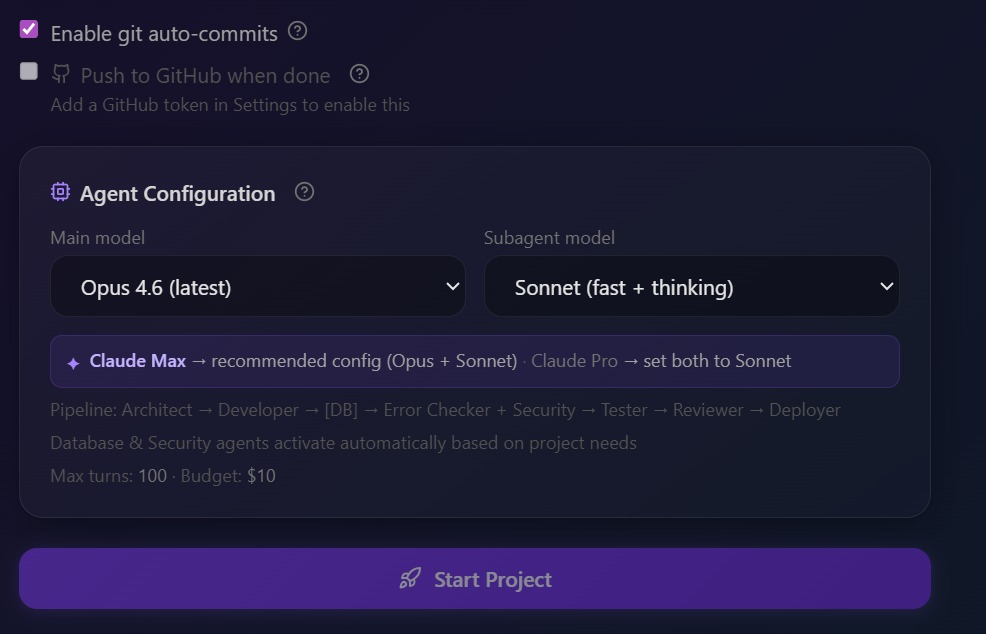
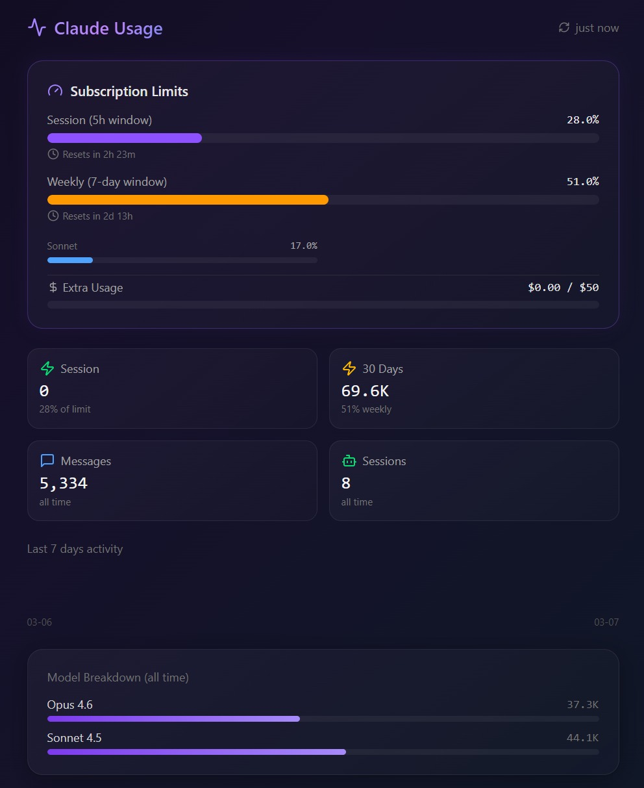

<div align="center">

# 🎵 Orchestra AI

### From idea to verified app — new build or existing repo.

[](https://www.npmjs.com/package/orchestra-ai-app)
[](https://nodejs.org)
[](LICENSE)
[](https://github.com/miguel2862/orchestra-ai)
[](https://anthropic.com)

<br/>

**Describe a new product or point Orchestra at an existing repository. Ten specialized agents can participate end to end — planning, implementing, reviewing, deploying, and validating the UI in a real browser. Nine core agents run on every project, and a Database specialist joins when the work clearly needs persistence.**

<br/>

[📦 npm package](https://www.npmjs.com/package/orchestra-ai-app) · [🐛 Issues](https://github.com/miguel2862/orchestra-ai/issues) · [🤖 Powered by Claude Agent SDK](https://github.com/anthropics/claude-code)

<br/>



</div>

---

## ⚡ Three steps. One orchestrated run.

```bash
npm install -g orchestra-ai-app   # 1. install once
orchestra-ai                      # 2. run
# 3. choose New Project or Existing Project in the browser
```

A browser window opens automatically. Choose the mode, tune models if you want, and watch the live dashboard as the agents move through the run.

---

## 🏗️ Architecture — controlled graph, not a blind pipeline

Most AI coding tools run agents in a straight line: A → B → C → D.
If D fails, the build stops. You start over.

**Orchestra is different.** The **Developer** agent sits at the center of a star. Quality gates branch out from Developer, loop back with structured fix briefs when they fail, and only then continue to deploy and browser QA. Failures become **automatic retries**, not dead ends.



> **Solid arrows** → forward pass (planned phases).
> **Dashed arrows** → feedback loops (automatic, only triggered when issues are found).

---

## 🤖 The 10 agents — 9 core + 1 conditional database specialist

Nine required agents run on every project. The tenth agent, `database`, is added only when the project clearly needs a real data layer.

---

### `Phase 0` · Plan

<table>
<tr>
<td width="60"><h3>🧠</h3></td>
<td>

**Product Manager**

Receives your raw idea and produces a complete **Product Requirements Document**. In `Existing Project` mode it starts with a repo audit and writes the PRD as a delta change plan instead of a rewrite.

`Produces` → `PRD.md` &nbsp;&nbsp; `Tools` → Web Search · Web Fetch

</td>
</tr>
</table>

---

### `Phase 1` · Design

<table>
<tr>
<td width="60"><h3>🏛️</h3></td>
<td>

**Architect**

Reads the PRD and decides *how* to build it. For greenfield work it designs the full system. For existing repos it writes the minimal architecture delta, preserved contracts, touched files, and execution commands.

`Produces` → `ARCHITECTURE.md` &nbsp;&nbsp; `Tools` → Filesystem read · Web Search

</td>
</tr>
</table>

---

### `Phase 2` · Build

<table>
<tr>
<td width="60"><h3>💻</h3></td>
<td>

**Developer** ⭐ *Hub*

The center of the star. Reads PRD + architecture and writes production code. Also receives structured fix reports from the quality agents and applies targeted corrections without rewriting what already works.

If Google Gemini is configured, Developer can optionally generate a small number of project-specific assets through Orchestra CLI commands when the product genuinely needs them, for example a before/after comparison image or custom empty-state art.

`Produces` → All production source changes &nbsp;&nbsp; `Tools` → Filesystem · Bash

</td>
</tr>
<tr>
<td width="60"><h3>🗄️</h3></td>
<td>

**Database** *(conditional)*

Activated only when the project needs persistent storage. Designs schema, migrations, indexes, and seed/setup flow. In existing repos it reviews whether a schema change is truly required before touching the data layer.

`Produces` → `DATABASE.md` · migrations · seeds &nbsp;&nbsp; `Tools` → Filesystem · Bash

</td>
</tr>
</table>

---

### `Phase 3` · Quality

Quality agents inspect the same codebase with independent retry budgets. Each one routes findings back to Developer as a structured fix brief: *what broke, where, why, and what to fix*. Developer applies the fix, then the gate re-checks.

<table>
<tr>
<td width="60"><h3>🔍</h3></td>
<td>

**Error Checker**

Runs build, lint, typecheck, and runtime validation. It is the first hard gate after implementation and catches missing dependencies, broken imports, bad scripts, and startup failures before downstream review.

`Triggers feedback when` → build, lint, type, or runtime validation fails &nbsp;&nbsp; `Max retries` → **3** &nbsp;&nbsp; `Tools` → Filesystem · Bash

</td>
</tr>
<tr>
<td width="60"><h3>🔒</h3></td>
<td>

**Security**

Audits for injection vulnerabilities, insecure authentication, exposed credentials, OWASP-style issues, and risky dependency choices. Critical and high-severity findings trigger a feedback loop.

`Triggers feedback when` → critical or high-severity vulnerability detected &nbsp;&nbsp; `Max retries` → **2** &nbsp;&nbsp; `Tools` → Filesystem · Bash

</td>
</tr>
<tr>
<td width="60"><h3>🧪</h3></td>
<td>

**Tester**

Writes and runs regression, unit, and integration tests. In existing repos it uses the repo's current test framework and preferred commands instead of inventing a parallel setup.

`Triggers feedback when` → any test is failing &nbsp;&nbsp; `Max retries` → **3** &nbsp;&nbsp; `Tools` → Filesystem · Bash

</td>
</tr>
<tr>
<td width="60"><h3>👁️</h3></td>
<td>

**Reviewer**

Final code review from a principal engineer perspective: correctness, performance, maintainability, risky patterns, integration mismatches, and missing tests. Blocker and critical issues trigger fixes; the rest are documented in `CODE_REVIEW.md`.

`Triggers feedback when` → blocker or critical issue found &nbsp;&nbsp; `Max retries` → **3** &nbsp;&nbsp; `Tools` → Filesystem

</td>
</tr>
</table>

---

### `Phase 4` · Ship + Browser QA

<table>
<tr>
<td width="60"><h3>🚀</h3></td>
<td>

**Deployer**

Writes the `Dockerfile`, `docker-compose.yml`, CI/CD workflows, `.env.example`, and the generated project `README.md`. Then starts the app locally, verifies the URL, consolidates the run into `ORCHESTRA_REPORT.md`, and hands the live URL to Visual Tester. Temporary listeners started from the project are cleaned up after the run finishes.

`Triggers feedback when` → app fails to start · endpoints don't respond &nbsp;&nbsp; `Max retries` → **2** &nbsp;&nbsp; `Tools` → Filesystem · Bash

`Produces` → `Dockerfile` · `docker-compose.yml` · `.github/workflows/` · `README.md` · `ORCHESTRA_REPORT.md`

</td>
</tr>
<tr>
<td width="60"><h3>🖥️</h3></td>
<td>

**Visual Tester**

Opens the running app in a real browser through Playwright MCP and tests the actual UI. It navigates routes, checks console output, clicks controls, types into forms, captures snapshots and screenshots, and fails the run if an apparently interactive control does nothing.

`Triggers feedback when` → browser tools are unavailable · no live URL exists · console/runtime issues appear · controls look interactive but do nothing &nbsp;&nbsp; `Max retries` → **3** &nbsp;&nbsp; `Tools` → Playwright browser · Filesystem · Bash

`Produces` → `VISUAL_TEST_REPORT.md`

</td>
</tr>
</table>

---

## 🔄 Automatic feedback loops

When a quality gate finds a problem, it does not just report it. It sends Developer a structured fix brief: *what broke, the exact file and line if known, why it matters, and what to do*. Developer applies a targeted fix. The gate re-checks. This cycle repeats until the gate passes or retries run out.

```
Quality gate finds issue
        │
        ▼
  Structured report ──────────────────────► Developer
  (file · line · why · what to fix)               │
        ▲                                          │ targeted fix
        │                                          ▼
        └──────────────────── re-check ◄──── Quality gate
```

> Retry budgets are **per gate**. Error Checker using all 3 retries does not consume Tester's retries.

**When retries are exhausted:** the pipeline continues rather than stopping. Unresolved issues are recorded in `.orchestra/run_*.json` so you can inspect what was found, what was attempted, and what remains.

**Hard artifact gates:** the run is not considered complete unless `PRD.md`, `ARCHITECTURE.md`, `VISUAL_TEST_REPORT.md`, and `ORCHESTRA_REPORT.md` exist.

---

## 🖥️ Live dashboard

Run `orchestra-ai` and your browser opens automatically. You are not watching a spinner — you are watching the orchestration work.

| What you see | Details |
|---|---|
| **Hub-and-spoke visualization** | The star topology rendered live — each agent node lights up as it activates and feedback arrows animate when a loop triggers |
| **Live output stream** | Actions, decisions, file writes, and verification steps streamed in real time |
| **Per-agent cost tracker** | Token count and USD for each agent, updating as they run |
| **Intervention chat** | Send a message to a running project without discarding current context |
| **Verified result card** | Final result text, verified local URL, and consolidated report path |
| **History + recovery** | Past projects stay browsable with stored events, recovered phase completions, cost breakdowns, and agent stats |

> Defaults to port **3847**, auto-reassigns if busy. You can run multiple projects simultaneously — each has its own event stream and cost tracker.

---

## 🧭 Two modes

| Mode | What Orchestra does |
|------|----------------------|
| **New Project** | Creates a fresh working directory, writes the PRD and architecture from scratch, builds the app, then deploys and visually verifies it |
| **Existing Project** | Works in-place on a repo path you provide, starts with a repo audit, writes a delta change plan, preserves repo conventions, uses preferred `start` / `test` / `lint` commands, and focuses on surgical changes plus regression coverage |

For existing repos you can add a local `.orchestrarc` file to define stack-specific guardrails, conventions, enabled or disabled guards, and longer stall timeouts for heavy agents.

Deleting an `Existing Project` run from History removes Orchestra metadata and event logs only. It does **not** delete the repository you pointed Orchestra at.

---

## 🧠 Learning and guardrails

Orchestra keeps a lightweight self-learning store in `~/.orchestra-ai/lessons.json`.

- Lessons are extracted from agent outputs, feedback loops, user feedback after completion, and runtime-gate failures.
- Relevant lessons are injected into later prompts so repeated mistakes become less likely over time.
- Repo-level stack guardrails from `.orchestrarc` are merged into those prompts for project-specific enforcement.
- Runtime gates still remain the source of truth: learned behavior helps, but artifacts and browser evidence are required before a run can pass.

---

## 📁 What gets generated

After a typical successful run, your project folder contains the app plus the orchestration artifacts used to build and verify it:

```
my-project/
├── src/                       # production code written or updated by Developer
├── tests/                     # tests written or extended by Tester
├── package.json
├── PRD.md                     # requirements or delta change plan
├── ARCHITECTURE.md            # full design or architecture delta
├── README.md                  # generated project README
├── ORCHESTRA_REPORT.md        # consolidated report across the run
├── .env.example               # environment variables template
└── .orchestra/
    ├── run_1712345678.json    # full run memory: cost, agent stats, issues found
    └── profile.json           # aggregated stats across all runs on this project
```

During the run you may also see intermediate reports such as `BUILD_VALIDATION_REPORT.md`, `SECURITY_REPORT.md`, `TEST_REPORT.md`, `CODE_REVIEW.md`, `DATABASE.md`, and `VISUAL_TEST_REPORT.md`.

The `.orchestra/` folder is how Orchestra remembers what it built. If you continue or modify the project later, agents can read prior run context instead of starting from zero.

---

## 🚀 Quick Start

| | |
|---|---|
|  |  |

### macOS / Linux

```bash
npm install -g orchestra-ai-app
orchestra-ai
```

### Windows

Open **PowerShell** or **Command Prompt** as Administrator:

```powershell
npm install -g orchestra-ai-app
orchestra-ai
```

<details>
<summary>Windows execution policy error?</summary>

```powershell
Set-ExecutionPolicy -Scope CurrentUser -ExecutionPolicy RemoteSigned
```

Then re-run `orchestra-ai`.

</details>

On first launch, a setup wizard runs automatically — auth method, API keys or Claude login, working directory, model defaults, MCP servers, and theme.

---

## 📋 Requirements

| | |
|--|--|
| **Node.js** | v18 or higher — [download here](https://nodejs.org) |
| **Claude auth** | Any plan below — Pro, Max, or API key |

### Which Anthropic plan do I need?

| Plan | Price | Works? | Usage |
|---|---|:---:|---|
| **Claude Pro** | $20 / mo | ✅ | Included in plan — lower limits |
| **Claude Max 5×** | $100 / mo | ✅ | 5× more usage than Pro |
| **Claude Max 20×** | $200 / mo | ✅ | 20× more usage than Pro |
| **API key only** | Pay per token | ✅ | No limits — billed directly |

> All plans share the same token pool with claude.ai. Max is recommended for heavy daily use.

**Option A — Claude subscription (Pro or Max)** *(recommended — usage included in plan)*
```bash
npm install -g @anthropic-ai/claude-code
claude login
```

**Option B — Anthropic API key** *(pay per token)*
Get yours at [console.anthropic.com](https://console.anthropic.com) and paste it during the setup wizard.

---

## 💰 Cost

### With a Claude subscription

**No extra token cost.** Orchestra uses your plan's built-in quota — no separate billing. The **Claude Usage** panel in the dashboard shows both limits live so you know how much headroom you have before starting a project.



Claude subscriptions have two independent rolling windows:

| Limit | Window | How it works |
|-------|--------|------------------|
| **Session** | 5-hour rolling | Resets every 5 hours. The countdown tells you when you can run again at full speed. |
| **Weekly** | 7-day rolling | Cumulative usage over the last 7 days. Renews the same day and time each week. |

> Planning a big project? Check the weekly bar first. Above ~80%? Wait for the reset or switch that run to API key mode.

### With an API key

| Model | Input | Output | Best for |
|-------|------:|------:|---------|
| **Opus 4.6** | $5 / 1M | $25 / 1M | Most complex, long projects |
| **Sonnet 4.6** | $3 / 1M | $15 / 1M | Recommended balance |
| **Haiku 4.5** | $1 / 1M | $5 / 1M | Fastest, cheapest |

A typical full-stack project with the core agent set on Sonnet 4.6 is often **$0.50 – $3.00** depending on complexity.
You can assign a cheaper model to subagents in Settings to cut cost significantly.

> Always verify current prices at [anthropic.com/pricing](https://www.anthropic.com/pricing).

Orchestra prefers the **latest stable alias** in each family, while still letting you pin dated snapshots when you want reproducibility.

---

## ⚙️ Configuration

Everything is configurable from the **Settings** page in the web UI. Global config is stored per-user:

| OS | Config location |
|----|-----------------|
| macOS / Linux | `~/.orchestra-ai/config.json` |
| Windows | `C:\Users\YourName\.orchestra-ai\config.json` |

<details>
<summary>Global settings</summary>

| Setting | Description |
|---------|-------------|
| Anthropic API key | For API key auth |
| GitHub token | Lets deploy flows create repos and push code |
| Gemini API key | Optional key for on-demand AI asset generation when a project truly needs custom imagery |
| Default projects folder | Where new projects are created |
| Main model | Latest aliases or pinned snapshots |
| Subagent model | Use a cheaper model for specialized gates |
| Extended thinking | Deeper reasoning for harder projects |
| Budget cap | Maximum USD spend per project |
| Max turns | Hard limit on agent iterations |
| Git auto-commits | Commit after completed phases |
| UI theme | Light / Dark / System |
| MCP servers | Per-server enable/disable in the UI |

</details>

Repo-level overrides live in `.orchestrarc` inside the target repository. Use it to define:

- stack guardrails such as React rendering, motion accessibility, map-data validation, Next.js boundaries, Supabase safety, or project-specific rules
- repo conventions for state, UI, and testing
- enabled or disabled guards per repository
- global or per-agent stall timeout overrides for slow architecture or implementation passes

Example:

```json
{
  "pipeline": {
    "subagentStallTimeoutMs": 900000
  },
  "stack": {
    "enabledGuards": ["react_rendering", "motion_accessibility", "api_contracts"],
    "guardrails": [
      "Do not edit files under legacy/ without an explicit reason in the task prompt."
    ]
  },
  "agents": {
    "architect": { "stallTimeoutMs": 1200000 },
    "developer": { "stallTimeoutMs": 1200000 }
  }
}
```

---

## 🧩 MCP Servers

Orchestra uses the [Model Context Protocol](https://modelcontextprotocol.io) to give agents real tools — not just text generation:

| Server | Gives agents the ability to… |
|--------|------------------------------|
| `filesystem` | Read, write, edit, and navigate project files |
| `duckduckgo` | Search the web for docs, packages, and examples |
| `playwright` | Control a real browser — navigate, click, type, inspect console, capture snapshots and screenshots |
| `context7` | Look up current package and framework documentation |
| `memory` | Share persistent context across runs |
| `sequential-thinking` | Structured reasoning for complex multi-step tasks |

Enable or disable each server from **Settings → MCP Servers**. `playwright` is automatically kept enabled because `visual_tester` is a blocking gate.

---

## 📂 Project templates

| Template | What it builds |
|----------|----------------|
| **Full-stack web app** | Frontend + backend app with realistic production setup |
| **API backend** | REST or GraphQL API with auth and docs |
| **Landing page** | Static marketing site with stronger visual emphasis |
| **CLI tool** | Node.js command-line utility |
| **Custom** | Describe anything in plain English |

---

## ❓ Frequently asked

<details>
<summary>Does it work on existing projects or only new ones?</summary>

Both are supported.

- `New Project` starts from an empty working directory and runs the full greenfield flow.
- `Existing Project` works in-place on a repo path you provide, starts with a repo audit, writes a delta change plan, and then applies the same specialist-agent quality gates with regression focus.

For existing repos you can also add a local `.orchestrarc` file to define stack conventions, extra guardrails, and agent-level overrides such as longer stall timeouts for heavy architecture or implementation passes.

Deleting the run from History only removes Orchestra metadata for that run. It does not delete the existing repository itself.

</details>

<details>
<summary>Does the visual tester open a real browser?</summary>

Yes. Orchestra configures the `playwright` MCP server by default and the `visual_tester` agent uses Playwright browser tools against the running app.

The visual gate is blocking:

- it must use real browser tools such as navigation, repeated snapshots, console inspection, screenshots, and real interactions
- it fails if browser tools are unavailable or if no live URL exists
- it fails if a control looks interactive but clicking or typing produces no visible effect
- it writes `VISUAL_TEST_REPORT.md` with page coverage, interaction coverage, console errors, visual issues, interactive issues, design assessment, and verdict

</details>

<details>
<summary>Can Orchestra use Gemini to create project images?</summary>

Yes, but it is intentionally **on-demand**, not automatic decoration. When a Gemini API key is configured, the Developer agent can call Orchestra CLI commands to create a small number of project-specific assets such as:

- before / after scene comparisons
- hero illustrations tied to the actual product concept
- custom icons or empty-state art

Typical commands:

```bash
orchestra-ai gemini-status --json
orchestra-ai gemini-image --prompt "before-after urban tree restoration scene" --output public/generated/tree-before-after.png --aspect-ratio 16:9 --json --soft-fail
```

The agent is instructed to use this sparingly. If Gemini is unavailable, rate-limited, or the key is missing, the run continues without blocking and falls back to CSS, SVG, charts, or other non-generated visuals. Use `--soft-fail` for optional generation inside agent workflows.

</details>

<details>
<summary>Can I stop a run midway and resume it?</summary>

Yes — and it picks up from the saved Claude session. When you click **Stop**, Orchestra stores the session ID and marks the run as stopped. When you click **Continue**, it resumes the saved conversation context instead of starting over.

The **Continue** button appears after the run ends with `completed`, `failed`, or `stopped`. There is no mid-run pause state.

</details>

<details>
<summary>Do temporary dev servers or ports stay open after the run?</summary>

No. When Orchestra starts temporary local listeners from the project's working directory for deploy verification or browser QA, it closes them after the pipeline finishes or when you stop the run.

That cleanup is scoped to listeners started from the project folder. It does not kill unrelated servers you started manually outside the project.

</details>

<details>
<summary>What happens if Claude hits a rate limit mid-run?</summary>

The Claude Agent SDK handles rate-limit retries automatically with exponential backoff. If the limit is sustained, the active agent eventually fails and the run reports an error. Files written up to that point are preserved.

</details>

<details>
<summary>Can I run multiple projects at the same time?</summary>

Yes. The server tracks each run independently in memory and on disk. Start another project while one is already running and both appear in the sidebar with their own event stream and cost tracking.

</details>

<details>
<summary>Where are my projects and run history saved?</summary>

- **Project files** → the working directory you chose during setup (default: `~/orchestra-projects/`)
- **Project metadata + event logs** → `~/.orchestra-ai/projects/`
- **User config** → `~/.orchestra-ai/config.json`
- **Learned lessons** → `~/.orchestra-ai/lessons.json`
- **Run memory** → inside each project at `.orchestra/run_*.json`

</details>

<details>
<summary>Is my API key or GitHub token stored securely?</summary>

They are stored locally in `~/.orchestra-ai/config.json` on your machine. Orchestra does not run a hosted backend for your projects. Secrets are only used when making direct API calls to Anthropic, GitHub, or another provider you configured.

</details>

---

## 🔧 Troubleshooting

<details>
<summary>Updating to a new version — "file already exists" error</summary>

If you already have Orchestra installed and `npm install -g orchestra-ai-app` throws an `EEXIST` error, uninstall first:

```bash
npm uninstall -g orchestra-ai-app && npm install -g orchestra-ai-app
```

</details>

<details>
<summary>How do I update Orchestra to the latest version?</summary>

Use:

```bash
npm install -g orchestra-ai-app@latest
```

If npm reports an `EEXIST` conflict, uninstall the old global package first and then install again.

</details>

<details>
<summary>Command not found after install</summary>

Make sure npm's global bin directory is in your `PATH`. Run `npm bin -g` to find it, then add it to your shell profile (`.zshrc`, `.bashrc`, etc.).

On macOS with Homebrew-managed Node, the global bin is usually `/opt/homebrew/bin`.

</details>

<details>
<summary>Browser does not open automatically</summary>

Navigate manually to `http://localhost:3847` or the port shown in the terminal output. On some systems the OS can block `open` / `start` calls.

</details>

<details>
<summary>`orchestra-ai` hangs on startup</summary>

Check that port 3847, or whichever port it picked, is not blocked by a firewall. Stop any other local servers using that port and re-run. The terminal output shows the exact port in use.

</details>

---

## 🪟 Windows notes

- Paths use platform-native separators — handled automatically
- `orchestra-ai` works in PowerShell, CMD, and Windows Terminal
- Orchestra auto-detects `claude.cmd` when using Claude subscription auth
- Playwright install and browser verification use Windows-safe `npx.cmd` invocations
- Temporary app listeners are cleaned up with Windows process APIs after verification
- If an agent shell fails to start on Windows, install Git for Windows (Git Bash) or WSL for the most reliable task-shell compatibility
- Projects default to `C:\Users\YourName\orchestra-projects\`

---

## 🛠️ Development

<details>
<summary>Run locally from source</summary>

```bash
git clone https://github.com/miguel2862/orchestra-ai.git
cd orchestra-ai
npm install
npm run dev        # starts server + UI in watch mode
```

```bash
npm run build      # production build
npm run typecheck  # TypeScript check with no emit
```

</details>

---

## 📄 License

MIT — free to use, modify, and distribute.

---

<div align="center">

Built with the [Claude Agent SDK](https://github.com/anthropics/claude-code) by Anthropic

</div>
